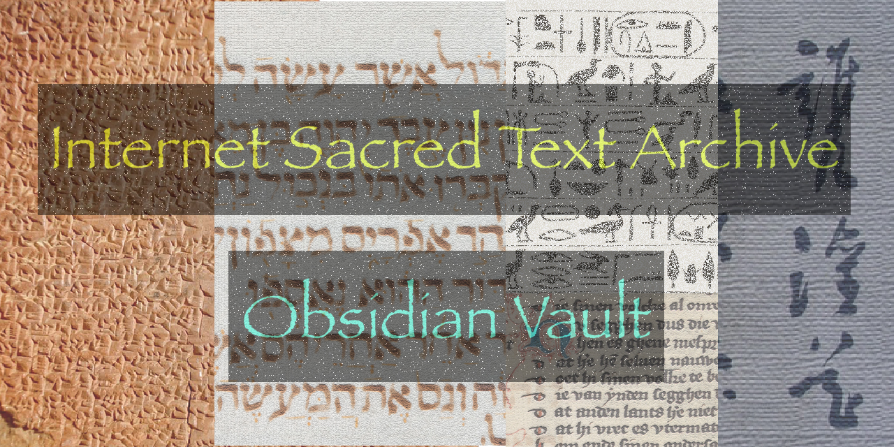

Get started -> [Vault Index](sacred_obsidian_vault/index.md)
- [afr/mind/mind00.md](sacred_obsidian_vault/afr/mind/mind00.md)

## Use everything below as a reference
Host your second brain and [digital garden](https://jzhao.xyz/posts/networked-thought) for free. Quartz features

1. Extremely fast natural-language [[notes/search]]
2. Customizable and hackable design based on [Hugo](https://gohugo.io/)
3. Automatically generated backlinks, link previews, and local graph
4. Built-in [[notes/CJK + Latex Support (测试) | CJK + Latex Support]] and [[notes/callouts | Admonition-style callouts]]
5. Support for both Markdown Links and Wikilinks

Check out some of the [amazing gardens that community members](notes/showcase.md) have published with Quartz or read about [why I made Quartz](notes/philosophy.md) to begin with.

## Get Started
> 📚 Step 1: [Setup your own digital garden using Quartz](notes/setup.md)

Returning user? Figure out how to [[notes/updating|update]] your existing Quartz garden.

If you prefer browsing the contents of this site through a list instead of a graph, you see a list of all [setup-related notes](/tags/setup).

### Troubleshooting
- 🚧 [Troubleshooting and FAQ](notes/troubleshooting.md)
- 🐛 [Submit an Issue](https://github.com/jackyzha0/quartz/issues)
- 👀 [Discord Community](https://discord.gg/cRFFHYye7t)

